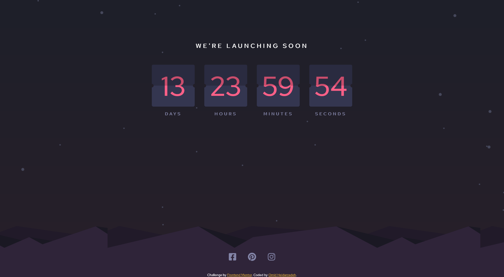

# Frontend Mentor - Launch countdown timer solution

This is a solution to the [Launch countdown timer challenge on Frontend Mentor](https://www.frontendmentor.io/challenges/launch-countdown-timer-N0XkGfyz-). Frontend Mentor challenges help you improve your coding skills by building realistic projects.

## Table of contents

- [Overview](#overview)
  - [The challenge](#the-challenge)
  - [Screenshot](#screenshot)
  - [Links](#links)
- [My process](#my-process)
  - [Built with](#built-with)
  - [What I learned](#what-i-learned)
- [Author](#author)

## Overview

### The challenge

Users should be able to:

- See hover states for all interactive elements on the page
- See a live countdown timer that ticks down every second (start the count at 14 days)
- **Bonus**: When a number changes, make the card flip from the middle

### Screenshot



### Links

- Solution URL: [https://github.com/Omid-Heidarzadeh/Launch-Countdown-Timer-Page](https://github.com/Omid-Heidarzadeh/Launch-Countdown-Timer-Page)
- Live Site URL: [https://omid-heidarzadeh.github.io/Launch-Countdown-Timer-Page/](https://omid-heidarzadeh.github.io/Launch-Countdown-Timer-Page/)

## My process

### Built with

- Semantic HTML5 markup
- SCSS variables, mixins
- Flexbox
- CSS Grid
- Vanilla JavaScript
- Mobile-first workflow
- Font Awesome

### What I learned

First challenge that I've encounterd was implementing proper HTML structure and CSS styling for the timer components. I wanted to implement `flip in middle` functionality. So, I divided each timer component into top and bottom halfs each of which containing front and back parts.

```html
<div class="widget__wrapper flip">
  <span class="bottom-back">00</span>
  <span class="bottom-front flip-bottom">00</span>
  <span class="top-back">00</span>
  <span class="top-front flip-top">00</span>
</div>
```

Each part has proper `z-index` according to it's position and responsibility. The back parts are fixed and front parts have responsibility of changing number by `rotating over their X-Axis` at middle of the widget. This functionality needs to be repeated mutiple times so the `CSS Animation` is a good fit for it.

```css
@keyframes flipTop {
  0% {
    transform: rotateX(0deg);
  }
  50% {
    transform: rotateX(-90deg);
  }
  100% {
    transform: rotateX(-90deg);
  }
}

@keyframes flipBottom {
  0% {
    transform: rotateX(90deg);
  }
  50% {
    transform: rotateX(0deg);
  }
  100% {
    transform: rotateX(0deg);
  }
}
```

In order to simulate a fliping part that has two different numbers (half of numbers, in fact) I came up with using two distinct but equal parts as each side. The first one used as `top-front` part and second as `bottom-front` part. Each one rotate half of way which is 90 degrees and their movement is just like domino's, the second part will start rotating just after the first one has finished it's rotation.

```css
.flip .flip-top {
  animation: flipTop 1s 0s linear infinite;
}

.flip .flip-bottom {
  animation: flipBottom 1s 0.5s linear infinite;
}
```

And then I used Javascript for calculation and management of remaining time, also changing timer values of corresponding widgets.

## Author

- Frontend Mentor - [@Omid-Heidarzadeh](https://www.frontendmentor.io/profile/Omid-Heidarzadeh)
- GitHub - [Omid-Heidarzadeh](https://github.com/Omid-Heidarzadeh)
- Linkedin - [Omid Heidarzadeh](https://www.linkedin.com/in/omid-heidarzadeh-112416146/)
